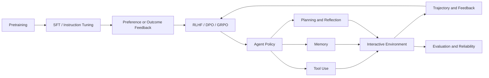

# Agent & Post-Training Knowledge Map

> W01 建骨架，W12 完成；中间只追加经阅读确认的连接。

```mermaid
flowchart LR
  A["Pretraining"] --> B["SFT / Instruction Tuning"]
  B --> C["Preference or Outcome Feedback"]
  C --> D["RLHF / DPO / GRPO"]
  D --> E["Agent Policy"]
  E --> F["Tool Use"]
  E --> G["Memory"]
  E --> H["Planning and Reflection"]
  F --> I["Interactive Environment"]
  G --> I
  H --> I
  I --> J["Trajectory and Feedback"]
  J --> D
  I --> K["Evaluation and Reliability"]
```

## 已确认连接

TODO

## 尚属假设的连接

TODO
