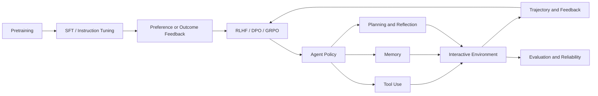

# Agent & Post-Training Knowledge Map

> W01 建骨架，W12 完成；中间只追加经阅读确认的连接。

## 已确认连接

TODO

## 尚属假设的连接

- [待验证] InstructGPT 把一次 prompt–response 交互建模为单步 bandit；扩展到 Agent 时，需要把 observation、tool result 和跨步 credit assignment 显式纳入 MDP。
- [待验证] Reward model 学到的是特定标注流程下的偏好代理；Agent 的长期可靠性还取决于环境反馈是否可观测、可归因且难以被策略利用。
- [待验证] KL 约束和预训练混合可视为保留基础能力的两种不同正则化：前者限制 policy 偏移，后者直接维持原分布上的似然；二者不能自动保证工具调用安全。
